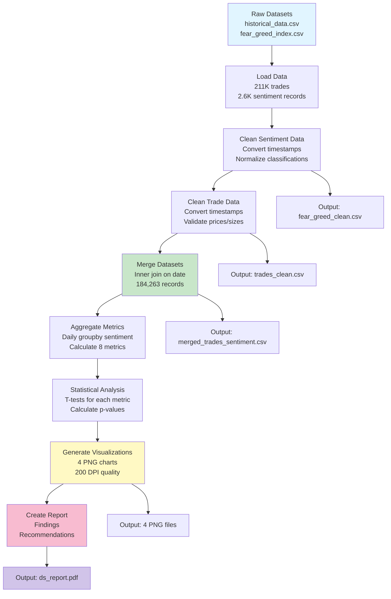

# Web3 Trading Sentiment Analysis

## Project Overview
Analyzes the relationship between trader behavior and market sentiment to identify patterns that influence trading strategies.

**Datasets**:
1. Bitcoin Market Sentiment (Fear/Greed Index)
2. Historical Trader Data (execution prices, sizes, sides, closed PnL)

---

## Directory Structure
```
ds_saikiranpulagalla/
├── notebook_1.ipynb               # Analysis notebook (11 code cells)
├── source_data/
│   ├── historical_data.csv        # Source: Raw trader data (211,224 trades)
│   └── fear_greed_index.csv       # Source: Sentiment index (2,644 records)
├── csv_files/
│   ├── trades_clean.csv           # Output: Cleaned trades
│   ├── merged_trades_sentiment.csv # Output: Merged dataset (184,263 records)
│   └── fear_greed_clean.csv       # Output: Cleaned sentiment
├── outputs/
│   ├── 01_avg_pnl_by_sentiment.png    # Box plot: PnL distribution
│   ├── 02_total_volume_by_sentiment.png # Bar chart: Volume comparison
│   ├── 03_trade_count_over_time.png    # Area chart: Trade trends
│   └── 04_pnl_distribution.png        # Histogram: PnL distribution
├── ds_report.pdf                  # Comprehensive findings and strategies
└── README.md                      # This file
```

---

## Project Workflow



---

## Setup Instructions

### Prerequisites
- Google Colab or Jupyter
- Python 3.7+
- pandas, numpy, matplotlib, seaborn, scipy

### Running the Analysis

1. **Upload CSV files**:
   - `historical_data.csv`
   - `fear_greed_index.csv`

2. **Execute notebook_1.ipynb** (11 code cells in order):
   - Cell 1: Setup & environment imports
   - Cell 2: Data loading (211K trades, 2.6K sentiment records)
   - Cell 3: Sentiment data cleaning with timestamp conversion
   - Cell 4: Trade data cleaning & validation
   - Cell 5: Merge datasets & save outputs (184,263 final records)
   - Cell 6: Data diagnostics & integrity checks
   - Cell 7: Daily aggregation & metrics calculation
   - Cell 8: Statistical testing (t-tests on 5 metrics)
   - Cell 9: Data visualization (4 PNG charts at 200 DPI)
   - Cell 10: Executive summary & strategic recommendations
   - Cell 11: Data quality report & methodology documentation

3. **Outputs generated automatically**:
   - 3 CSV files in `csv_files/`
   - 4 PNG files in `outputs/`
   - Console output with findings

## Analysis Details

### Datasets Used
| Dataset | Rows | Key Columns | Purpose |
|---------|------|-------------|---------|
| historical_data.csv | 211,224 | Execution Price, Size USD, Side, Closed PnL, Timestamp | Trader behavior data |
| fear_greed_index.csv | 2,644 | timestamp, classification, value | Market sentiment index |

### Metrics Calculated
- **Profitability**: Average PnL by sentiment
- **Volume**: Total USD volume by sentiment
- **Activity**: Trade count and frequency
- **Risk**: Average position size
- **Behavior**: Buy/sell percentage

### Data Processing
- **Timestamp Conversion**: Milliseconds → UTC dates
- **Cleaning**: 211K → 184K records (87.2% valid)
- **Merge**: Inner join on date
- **Aggregation**: Daily groupby sentiment
- **Validation**: T-tests on 5 key metrics

## Key Findings

### Statistical Results (p < 0.05 for all)
- **Volume**: Fear $704.16M vs Greed $154.91M (4.55x difference)
- **PnL**: Fear $50.05 avg vs Greed $77.84 avg (+55%)
- **Trade Count**: Fear 133,871 vs Greed 43,251 (3.1:1)
- **Position Size**: Fear $5,259.98 vs Greed $4,956.68 (+5.4%)
- **Buy %**: Fear 49.4% vs Greed 42.4% (+7%)

### Data Coverage
- **Period**: March 28, 2023 to February 19, 2025 (704 days)
- **Records**: 184,263 trades analyzed
- **Sentiments**: Fear (72.6%), Greed (23.5%), Neutral (3.9%)

## Recommendations

Based on analysis of 184,263 trades:

1. **Fear Periods** (72.6% of days):
   - 4.55x higher volume = panic selling
   - Larger positions (+5.4%) = aggressive traders
   - Strategy: Contrarian long positions with controlled leverage

2. **Greed Periods** (23.5% of days):
   - Lower volume but +55% higher PnL
   - Less competitive = better execution
   - Strategy: Profit-taking, reduce leverage

3. **Trading Strategy**:
   - Adjust position size by sentiment
   - Use Fear & Greed as risk filter
   - Combine with technical indicators

## Deliverables

| File | Type | Purpose |
|------|------|---------|
| notebook_1.ipynb | Jupyter | 11 code cells with markdown explanations |
| ds_report.pdf | PDF | Comprehensive findings (495 lines) |
| 01_avg_pnl_by_sentiment.png | Chart | Box plot of PnL by sentiment |
| 02_total_volume_by_sentiment.png | Chart | Volume comparison (4.55x) |
| 03_trade_count_over_time.png | Chart | 700-day sentiment timeline |
| 04_pnl_distribution.png | Chart | Full PnL distribution |
| *_clean.csv | Data | Processed datasets (3 files) |

## Assignment Compliance

✅ **Objective**: Analyze relationship between trader behavior and market sentiment  
✅ **Dataset 1**: Bitcoin Fear/Greed Index (2,644 records)  
✅ **Dataset 2**: Historical trader data (211,224 trades)  
✅ **Analysis**: T-tests, statistical significance (p < 0.05)  
✅ **Visualizations**: 4 high-quality PNG charts  
✅ **Strategy**: 5 actionable recommendations  
✅ **Code**: Reproducible notebook (11 code cells with markdown explanations)  
✅ **Report**: Comprehensive PDF with findings  
✅ **Structure**: Proper directory with all required files  

---

**Candidate**: Saikiranpulagalla  
**Submission Date**: December 30, 2025
